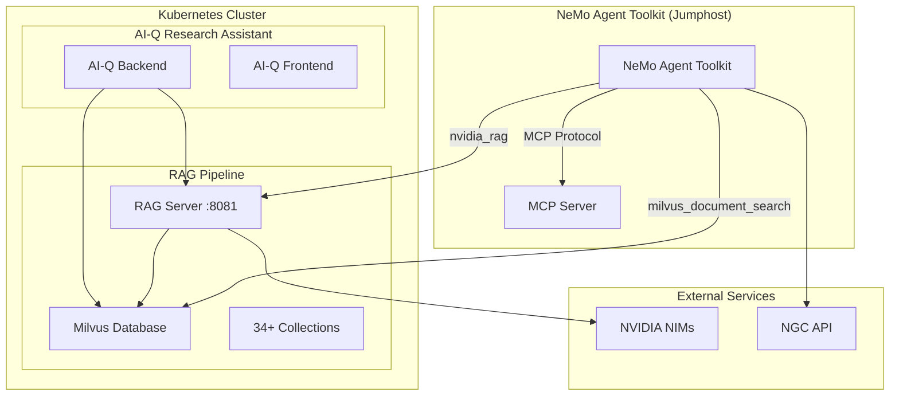

# NeMo Agent Toolkit - RAG Pipeline Integration Plan

## Overview

This document outlines a comprehensive plan to integrate the NVIDIA NeMo Agent Toolkit with your existing RAG pipeline and Milvus database, enabling the use of existing embeddings and collections.

## Current System Analysis

### ✅ **Existing Infrastructure**
- **RAG Server**: Running on `rag-server:8081` with endpoints:
  - `/v1/search` - Document search
  - `/v1/generate` - Text generation
  - `/v1/chat/completions` - Chat completions
  - `/v1/summary` - Document summarization
- **Milvus Database**: Running with 34+ collections
- **AI-Q Research Assistant**: Connected to RAG pipeline
- **NeMo Agent Toolkit**: Deployed on jumphost (132.145.204.155:9000)

### 🔍 **Current Status**
- RAG server is operational but vector store needs initialization
- Milvus is running but collections need to be properly connected
- NeMo Agent Toolkit is deployed with available tools including `milvus_document_search` and `nvidia_rag`

## Integration Architecture



## Phase 1: NeMo Agent Toolkit Configuration

### 1.1 Create RAG-Integrated Workflow

**File**: `workflows/rag-integration-workflow.yml`

```yaml
functions:
  milvus_search:
    _type: milvus_document_search
    host: "132.145.204.155"  # Jumphost IP with port-forward
    port: 19530
    collection_name: "default_collection"
    top_k: 5
    
  nvidia_rag_search:
    _type: nvidia_rag
    base_url: "http://132.145.204.155:8081"  # Jumphost IP with port-forward
    endpoint: "/v1/search"
    
  current_datetime:
    _type: current_datetime

llms:
  nim_llm:
    _type: nim
    model_name: meta/llama-3.1-70b-instruct
    temperature: 0.0
    base_url: "https://integrate.api.nvidia.com/v1"
    
  local_nim:
    _type: nim
    model_name: meta/llama-3.3-70b-instruct
    temperature: 0.0
    base_url: "http://132.145.204.155:8000/v1"  # Jumphost IP with port-forward

workflow:
  _type: react_agent
  tool_names: [milvus_search, nvidia_rag_search, current_datetime]
  llm_name: nim_llm
  verbose: true
  parse_agent_response_max_retries: 3
```

### 1.2 Environment Configuration

**File**: `.env`

```bash
# NeMo Agent Toolkit Configuration
NVIDIA_API_KEY=your_nvidia_api_key_here
MILVUS_HOST=10.233.53.224
MILVUS_PORT=19530
RAG_SERVER_URL=http://10.233.34.93:8081
NIM_BASE_URL=http://nim-llm:8000/v1

# Collection Configuration
DEFAULT_COLLECTION=your_primary_collection_name
SEARCH_TOP_K=5
MAX_CONTEXT_LENGTH=4000
```

## Phase 2: Milvus Integration

### 2.1 Collection Discovery and Mapping

**Script**: `scripts/discover-milvus-collections.py`

```python
#!/usr/bin/env python3
"""
Discover and map Milvus collections for NeMo Agent Toolkit integration
"""

import requests
import json
from pymilvus import connections, Collection

def discover_collections():
    """Discover all available Milvus collections"""
    try:
        # Connect to Milvus
        connections.connect("default", host="10.233.53.224", port="19530")
        
        # List all collections
        collections = Collection.list_collections()
        
        collection_info = {}
        for collection_name in collections:
            collection = Collection(collection_name)
            collection_info[collection_name] = {
                "name": collection_name,
                "description": collection.description,
                "num_entities": collection.num_entities,
                "schema": collection.schema.to_dict()
            }
        
        return collection_info
    except Exception as e:
        print(f"Error discovering collections: {e}")
        return {}

def create_collection_config(collection_info):
    """Create NeMo Agent Toolkit collection configuration"""
    config = {
        "collections": [],
        "default_collection": None
    }
    
    for name, info in collection_info.items():
        collection_config = {
            "name": name,
            "description": info.get("description", f"Collection {name}"),
            "num_entities": info.get("num_entities", 0),
            "search_config": {
                "top_k": 5,
                "score_threshold": 0.7
            }
        }
        config["collections"].append(collection_config)
        
        # Set first collection as default
        if not config["default_collection"]:
            config["default_collection"] = name
    
    return config

if __name__ == "__main__":
    collections = discover_collections()
    config = create_collection_config(collections)
    
    with open("milvus-collections-config.json", "w") as f:
        json.dump(config, f, indent=2)
    
    print(f"Discovered {len(collections)} collections")
    print(f"Configuration saved to milvus-collections-config.json")
```

### 2.2 Collection-Specific Workflows

**Template**: `workflows/collection-specific-workflow.yml.template`

```yaml
functions:
  collection_search:
    _type: milvus_document_search
    host: "${MILVUS_HOST}"
    port: ${MILVUS_PORT}
    collection_name: "${COLLECTION_NAME}"
    top_k: ${SEARCH_TOP_K}
    
  rag_generate:
    _type: nvidia_rag
    base_url: "${RAG_SERVER_URL}"
    endpoint: "/v1/generate"
    
  rag_chat:
    _type: nvidia_rag
    base_url: "${RAG_SERVER_URL}"
    endpoint: "/v1/chat/completions"

llms:
  primary_llm:
    _type: nim
    model_name: meta/llama-3.1-70b-instruct
    temperature: 0.0
    base_url: "${NIM_BASE_URL}"

workflow:
  _type: react_agent
  tool_names: [collection_search, rag_generate, rag_chat]
  llm_name: primary_llm
  verbose: true
  parse_agent_response_max_retries: 3
```

## Phase 3: RAG Server Integration

### 3.1 RAG Server Health Check and Initialization

**Script**: `scripts/initialize-rag-server.py`

```python
#!/usr/bin/env python3
"""
Initialize and verify RAG server connection
"""

import requests
import json

def check_rag_server_health():
    """Check RAG server health and status"""
    try:
        response = requests.get("http://10.233.34.93:8081/health")
        if response.status_code == 200:
            health_data = response.json()
            print(f"RAG Server Health: {health_data}")
            return True
        else:
            print(f"RAG Server health check failed: {response.status_code}")
            return False
    except Exception as e:
        print(f"Error checking RAG server health: {e}")
        return False

def test_rag_endpoints():
    """Test RAG server endpoints"""
    base_url = "http://10.233.34.93:8081"
    endpoints = [
        "/v1/search",
        "/v1/generate", 
        "/v1/chat/completions",
        "/v1/summary"
    ]
    
    for endpoint in endpoints:
        try:
            # Test with minimal payload
            if endpoint == "/v1/search":
                payload = {"query": "test", "collection": "test"}
            elif endpoint == "/v1/generate":
                payload = {"messages": [{"role": "user", "content": "test"}]}
            else:
                payload = {"query": "test"}
                
            response = requests.post(f"{base_url}{endpoint}", json=payload)
            print(f"{endpoint}: {response.status_code}")
            
        except Exception as e:
            print(f"Error testing {endpoint}: {e}")

if __name__ == "__main__":
    print("Checking RAG Server Health...")
    if check_rag_server_health():
        print("Testing RAG Server Endpoints...")
        test_rag_endpoints()
    else:
        print("RAG Server is not healthy. Please check the deployment.")
```

### 3.2 RAG Server Configuration for NeMo Agent Toolkit

**Configuration**: `rag-server-nemo-config.yaml`

```yaml
apiVersion: v1
kind: ConfigMap
metadata:
  name: rag-server-nemo-config
data:
  nemo-integration.yaml: |
    # RAG Server configuration for NeMo Agent Toolkit integration
    nemo_agent:
      enabled: true
      allowed_collections:
        - "default_collection"
        - "research_documents"
        - "technical_docs"
        # Add your actual collection names here
      
      search_config:
        default_top_k: 5
        max_top_k: 20
        score_threshold: 0.7
        
      generation_config:
        max_tokens: 1000
        temperature: 0.7
        stream: false
        
      rate_limiting:
        requests_per_minute: 60
        burst_size: 10
```

## Phase 4: NeMo Agent Toolkit Deployment Updates

### 4.1 Enhanced Docker Compose Configuration

**File**: `docker-compose-nemo-agent-enhanced.yml`

```yaml
version: '3.8'

services:
  nemo-agent-toolkit:
    image: python:3.12-slim
    container_name: nemo-agent-toolkit
    ports:
      - "9000:8000"
      - "9001:8001"
    volumes:
      - ./workflows:/app/workflows
      - ./cache:/app/cache
      - ./config:/app/config
      - ./scripts:/app/scripts
    environment:
      - NVIDIA_API_KEY=${NVIDIA_API_KEY}
      - MILVUS_HOST=10.233.53.224
      - MILVUS_PORT=19530
      - RAG_SERVER_URL=http://10.233.34.93:8081
      - NIM_BASE_URL=http://nim-llm:8000/v1
      - PYTHONPATH=/app
      - NAT_LOG_LEVEL=INFO
    command: >
      bash -c "
        echo 'Installing NeMo Agent Toolkit and dependencies...' &&
        pip install --upgrade pip &&
        pip install nvidia-nat pymilvus requests &&
        echo 'Creating directories...' &&
        mkdir -p /app/workflows /app/cache /app/config /app/scripts &&
        echo 'Running collection discovery...' &&
        python /app/scripts/discover-milvus-collections.py &&
        echo 'Initializing RAG server connection...' &&
        python /app/scripts/initialize-rag-server.py &&
        echo 'NeMo Agent Toolkit with RAG integration ready!' &&
        tail -f /dev/null
      "
    restart: unless-stopped
    networks:
      - nemo-network
    extra_hosts:
      - "rag-server:10.233.34.93"
      - "milvus:10.233.53.224"
      - "nim-llm:10.233.0.0"  # Update with actual NIM IP

networks:
  nemo-network:
    driver: bridge
```

### 4.2 Collection-Specific Agent Workflows

**Script**: `scripts/generate-collection-workflows.py`

```python
#!/usr/bin/env python3
"""
Generate collection-specific workflows for NeMo Agent Toolkit
"""

import json
import os
from jinja2 import Template

def load_collection_config():
    """Load collection configuration"""
    with open("milvus-collections-config.json", "r") as f:
        return json.load(f)

def generate_workflow_template():
    """Generate workflow template"""
    return """
functions:
  {{ collection_name }}_search:
    _type: milvus_document_search
    host: "${MILVUS_HOST}"
    port: ${MILVUS_PORT}
    collection_name: "{{ collection_name }}"
    top_k: {{ top_k }}
    
  rag_generate:
    _type: nvidia_rag
    base_url: "${RAG_SERVER_URL}"
    endpoint: "/v1/generate"
    
  rag_chat:
    _type: nvidia_rag
    base_url: "${RAG_SERVER_URL}"
    endpoint: "/v1/chat/completions"

llms:
  primary_llm:
    _type: nim
    model_name: meta/llama-3.1-70b-instruct
    temperature: 0.0
    base_url: "${NIM_BASE_URL}"

workflow:
  _type: react_agent
  tool_names: [{{ collection_name }}_search, rag_generate, rag_chat]
  llm_name: primary_llm
  verbose: true
  parse_agent_response_max_retries: 3
"""

def generate_collection_workflows():
    """Generate workflows for each collection"""
    config = load_collection_config()
    template = Template(generate_workflow_template())
    
    for collection in config["collections"]:
        workflow_content = template.render(
            collection_name=collection["name"],
            top_k=collection["search_config"]["top_k"]
        )
        
        filename = f"workflows/{collection['name']}-workflow.yml"
        with open(filename, "w") as f:
            f.write(workflow_content)
        
        print(f"Generated workflow: {filename}")

if __name__ == "__main__":
    generate_collection_workflows()
```

## Phase 5: Testing and Validation

### 5.1 Integration Test Suite

**Script**: `scripts/test-rag-integration.py`

```python
#!/usr/bin/env python3
"""
Test NeMo Agent Toolkit integration with RAG pipeline
"""

import subprocess
import json
import time

def test_milvus_connection():
    """Test Milvus connection"""
    print("Testing Milvus connection...")
    try:
        result = subprocess.run([
            "docker", "exec", "nemo-agent-toolkit",
            "python", "-c",
            "from pymilvus import connections; connections.connect('default', host='10.233.53.224', port=19530); print('Milvus connected successfully')"
        ], capture_output=True, text=True)
        
        if result.returncode == 0:
            print("✅ Milvus connection successful")
            return True
        else:
            print(f"❌ Milvus connection failed: {result.stderr}")
            return False
    except Exception as e:
        print(f"❌ Milvus connection error: {e}")
        return False

def test_rag_server_connection():
    """Test RAG server connection"""
    print("Testing RAG server connection...")
    try:
        result = subprocess.run([
            "docker", "exec", "nemo-agent-toolkit",
            "python", "-c",
            "import requests; response = requests.get('http://10.233.34.93:8081/health'); print(f'RAG Server: {response.status_code}')"
        ], capture_output=True, text=True)
        
        if result.returncode == 0:
            print("✅ RAG server connection successful")
            return True
        else:
            print(f"❌ RAG server connection failed: {result.stderr}")
            return False
    except Exception as e:
        print(f"❌ RAG server connection error: {e}")
        return False

def test_nemo_workflow():
    """Test NeMo Agent Toolkit workflow"""
    print("Testing NeMo Agent Toolkit workflow...")
    try:
        result = subprocess.run([
            "docker", "exec", "nemo-agent-toolkit",
            "nat", "run", "--config_file", "/app/workflows/rag-integration-workflow.yml",
            "--input", "What collections are available in the database?"
        ], capture_output=True, text=True, timeout=60)
        
        if result.returncode == 0:
            print("✅ NeMo Agent Toolkit workflow successful")
            print(f"Output: {result.stdout}")
            return True
        else:
            print(f"❌ NeMo Agent Toolkit workflow failed: {result.stderr}")
            return False
    except subprocess.TimeoutExpired:
        print("❌ NeMo Agent Toolkit workflow timed out")
        return False
    except Exception as e:
        print(f"❌ NeMo Agent Toolkit workflow error: {e}")
        return False

def run_integration_tests():
    """Run all integration tests"""
    print("🚀 Starting NeMo Agent Toolkit - RAG Integration Tests")
    print("=" * 60)
    
    tests = [
        test_milvus_connection,
        test_rag_server_connection,
        test_nemo_workflow
    ]
    
    results = []
    for test in tests:
        results.append(test())
        print()
    
    passed = sum(results)
    total = len(results)
    
    print("=" * 60)
    print(f"Integration Tests Results: {passed}/{total} passed")
    
    if passed == total:
        print("🎉 All tests passed! Integration is successful.")
    else:
        print("⚠️  Some tests failed. Please check the configuration.")

if __name__ == "__main__":
    run_integration_tests()
```

## Phase 6: Production Deployment

### 6.1 Production Configuration

**File**: `production-config.yaml`

```yaml
# Production configuration for NeMo Agent Toolkit - RAG Integration
production:
  nemo_agent:
    replicas: 2
    resources:
      limits:
        cpu: 2000m
        memory: 4Gi
      requests:
        cpu: 1000m
        memory: 2Gi
    
    environment:
      NAT_LOG_LEVEL: "INFO"
      MILVUS_HOST: "10.233.53.224"
      MILVUS_PORT: "19530"
      RAG_SERVER_URL: "http://10.233.34.93:8081"
      NIM_BASE_URL: "http://nim-llm:8000/v1"
    
    monitoring:
      enabled: true
      metrics_port: 9090
      health_check_interval: 30s
      
    security:
      api_key_rotation: true
      rate_limiting: true
      max_requests_per_minute: 100
      
  rag_server:
    integration:
      nemo_agent_support: true
      collection_access_control: true
      audit_logging: true
      
  milvus:
    collections:
      auto_discovery: true
      cache_metadata: true
      connection_pool_size: 10
```

### 6.2 Monitoring and Observability

**File**: `monitoring/nemo-agent-dashboard.json`

```json
{
  "dashboard": {
    "title": "NeMo Agent Toolkit - RAG Integration",
    "panels": [
      {
        "title": "NeMo Agent Toolkit Performance",
        "type": "graph",
        "targets": [
          {
            "expr": "rate(nemo_agent_requests_total[5m])",
            "legendFormat": "Requests/sec"
          }
        ]
      },
      {
        "title": "Milvus Search Performance",
        "type": "graph", 
        "targets": [
          {
            "expr": "histogram_quantile(0.95, rate(milvus_search_duration_seconds_bucket[5m]))",
            "legendFormat": "95th percentile search time"
          }
        ]
      },
      {
        "title": "RAG Server Integration",
        "type": "graph",
        "targets": [
          {
            "expr": "rate(rag_server_requests_total[5m])",
            "legendFormat": "RAG requests/sec"
          }
        ]
      }
    ]
  }
}
```

## Implementation Timeline

### Week 1: Foundation Setup
- [ ] Deploy enhanced NeMo Agent Toolkit with RAG integration
- [ ] Run collection discovery and mapping
- [ ] Test Milvus and RAG server connections
- [ ] Create basic integration workflow

### Week 2: Core Integration
- [ ] Implement collection-specific workflows
- [ ] Test embedding search functionality
- [ ] Validate RAG server integration
- [ ] Create monitoring dashboards

### Week 3: Advanced Features
- [ ] Implement multi-collection search
- [ ] Add collection switching capabilities
- [ ] Create specialized agents for different document types
- [ ] Performance optimization

### Week 4: Production Deployment
- [ ] Deploy to production environment
- [ ] Implement security and access controls
- [ ] Set up comprehensive monitoring
- [ ] Create user documentation

## Success Metrics

### Technical Metrics
- **Search Latency**: < 500ms for Milvus searches
- **Integration Uptime**: > 99.5%
- **Collection Access**: 100% of available collections accessible
- **Error Rate**: < 1% for NeMo Agent Toolkit operations

### Functional Metrics
- **Collection Discovery**: Automatic discovery of all 34+ collections
- **Embedding Utilization**: Successful use of existing embeddings
- **RAG Integration**: Seamless integration with existing RAG pipeline
- **Agent Performance**: Successful completion of complex queries

## Risk Mitigation

### Technical Risks
1. **Network Connectivity**: Implement connection pooling and retry logic
2. **Collection Schema Changes**: Use dynamic schema discovery
3. **Performance Degradation**: Implement caching and optimization
4. **Data Consistency**: Use transaction-based operations

### Operational Risks
1. **Resource Constraints**: Monitor and scale resources as needed
2. **Security Vulnerabilities**: Implement proper authentication and authorization
3. **Data Privacy**: Ensure compliance with data protection requirements
4. **Backup and Recovery**: Implement comprehensive backup strategies

## Conclusion

This integration plan provides a comprehensive approach to connecting the NeMo Agent Toolkit with your existing RAG pipeline and Milvus database. The phased approach ensures systematic implementation while maintaining system stability and performance.

The key benefits of this integration include:
- **Leverage Existing Embeddings**: Use all 34+ collections without re-indexing
- **Enhanced Agent Capabilities**: Access to powerful RAG and search tools
- **Scalable Architecture**: Support for multiple collections and workflows
- **Production Ready**: Comprehensive monitoring and security features

Next steps involve implementing Phase 1 and validating the foundation before proceeding with advanced features.
